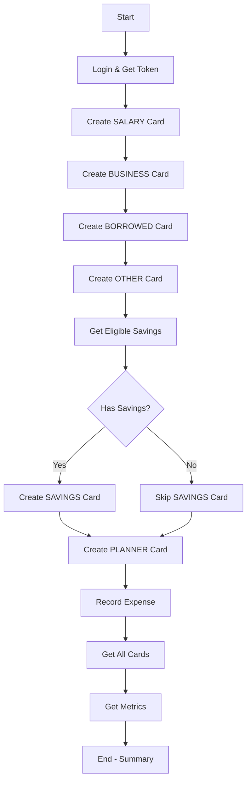

# Expense Testing Implementation Summary

## 📋 Overview
Comprehensive test suite created for all expense creation endpoints with multiple testing methods and detailed documentation.

## 🎯 What Was Created

### 1. **Python Test Script** (`tests/test_expense_creation.py`)
- **Purpose:** Automated Python-based test runner
- **Features:**
  - 10 comprehensive test cases
  - Automatic login and token management
  - Creates all types of expense cards
  - Tests planner functionality with AI analysis
  - Records expenses and retrieves metrics
  - Detailed console output with ✅/❌ indicators
- **Usage:**
  ```bash
  python tests/test_expense_creation.py
  ```

### 2. **Bash/Curl Test Script** (`tests/test_expense_creation.sh`)
- **Purpose:** Shell script for manual testing with curl
- **Features:**
  - Color-coded output (green/red/yellow/blue)
  - Tests all expense creation scenarios
  - Uses `jq` for JSON parsing
  - Automatic token extraction
  - Sequential test execution with IDs
- **Usage:**
  ```bash
  chmod +x tests/test_expense_creation.sh
  ./tests/test_expense_creation.sh
  ```

### 3. **Test Data JSON** (`tests/expense_test_data.json`)
- **Purpose:** Comprehensive reference for test payloads
- **Contents:**
  - All test scenario payloads
  - Valid enum values
  - Validation rules
  - Sample curl commands
  - Common error explanations
  - Test data variations
- **Usage:** Reference for API testing

### 4. **Testing Guide** (`tests/EXPENSE_TESTING_README.md`)
- **Purpose:** Complete documentation for testing
- **Contents:**
  - Quick start guides
  - All test scenarios with examples
  - Validation rules
  - Troubleshooting guide
  - Expected responses
  - Manual testing commands

## 🧪 Test Coverage

### Expense Card Creation Tests

| Test # | Type | Endpoint | Description |
|--------|------|----------|-------------|
| 1 | SALARY | `POST /api/v1/expenses/card` | Create card with salary income |
| 2 | BUSINESS | `POST /api/v1/expenses/card` | Create card with business revenue |
| 3 | BORROWED | `POST /api/v1/expenses/card` | Create card with borrowed funds |
| 4 | OTHER | `POST /api/v1/expenses/card` | Create card with other income (requires details) |
| 5 | SAVINGS | `GET /api/v1/expenses/eligible-savings` | Get eligible savings accounts |
| 6 | SAVINGS | `POST /api/v1/expenses/card` | Create card from savings payout |
| 7 | PLANNER | `POST /api/v1/expenses/planner/create` | Create budget planner with AI |
| 8 | EXPENSE | `POST /api/v1/expenses/card/{id}/expense` | Record expense on card |
| 9 | RETRIEVAL | `GET /api/v1/expenses/cards` | Get all expense cards |
| 10 | METRICS | `GET /api/v1/expenses/metrics` | Get expense metrics |

## ✅ Key Test Scenarios

### 1. External Income Cards
```json
{
  "name": "Card Name",
  "income_type": "SALARY|BUSINESS|BORROWED|OTHER",
  "initial_income": 150000.00,
  "income_details": "Required for OTHER type only"
}
```

### 2. Savings-Based Cards
```json
{
  "name": "Card from Savings",
  "income_type": "SAVINGS",
  "savings_id": 123
}
```

### 3. Planner Cards
```json
{
  "name": "Budget Plan",
  "capital": 250000.00,
  "planned_expenses": [
    {
      "category": "RENT",
      "amount": 80000.00,
      "purpose": "Monthly rent"
    }
  ]
}
```

### 4. Recording Expenses
```json
{
  "category": "FOOD",
  "description": "Lunch",
  "amount": 5500.00,
  "date": "2025-11-03"
}
```

## 🔧 Prerequisites

### For Python Tests
- Python 3.8+
- `requests` library: `pip install requests`
- Valid user credentials
- Active business assigned to user

### For Bash Tests
- `curl` command-line tool
- `jq` JSON processor: `brew install jq` (macOS) or `apt-get install jq` (Linux)
- Valid user credentials

## 🚀 Quick Start

### Method 1: Python (Recommended)
```bash
# 1. Install dependencies
pip install requests

# 2. Update credentials in test_expense_creation.py
#    - TEST_USER_EMAIL
#    - TEST_USER_PASSWORD

# 3. Run
python tests/test_expense_creation.py
```

### Method 2: Bash/Curl
```bash
# 1. Update credentials in test_expense_creation.sh
#    - TEST_EMAIL
#    - TEST_PASSWORD

# 2. Run
./tests/test_expense_creation.sh
```

### Method 3: Manual Testing
```bash
# Use the payloads from expense_test_data.json
# Follow examples in EXPENSE_TESTING_README.md
curl -X POST 'https://kopkad.onrender.com/api/v1/expenses/card' \
  -H 'Authorization: Bearer YOUR_TOKEN' \
  -H 'Content-Type: application/json' \
  -d @payload.json
```

## 📊 Valid Values Reference

### Income Types
- `SALARY` - Regular salary
- `BUSINESS` - Business revenue  
- `BORROWED` - Loans/borrowed funds
- `OTHER` - Other sources (requires `income_details`)
- `SAVINGS` - From savings account (requires `savings_id`)
- `PLANNER` - Budget planning (system-generated)

### Expense Categories
- `FOOD` - Food and groceries
- `TRANSPORT` - Transportation
- `ENTERTAINMENT` - Entertainment
- `UTILITIES` - Utilities bills
- `RENT` - Rent payments
- `MISC` - Miscellaneous

## ⚠️ Important Notes

### Validation Requirements
1. **OTHER income type** → `income_details` is REQUIRED
2. **SAVINGS income type** → `savings_id` is REQUIRED
3. **Non-SAVINGS types** → `initial_income` is REQUIRED
4. **Planned expenses** → Use `purpose` NOT `description`
5. **All enums** → Case-sensitive (must match exactly)

### Recent Backend Fixes Applied
- ✅ Fixed `Expense.actual_amount` → `Expense.amount`
- ✅ Fixed `Expense.card_id` → `Expense.expense_card_id`
- ✅ Added `from_attributes = True` to all Pydantic response schemas
- ✅ Fixed `business_id` NOT NULL constraint handling
- ✅ Fixed planner `description` → `purpose` field

## 🎯 Expected Outputs

### Successful Card Creation
```json
{
  "id": 5,
  "customer_id": 4,
  "business_id": 1,
  "name": "November Salary Card",
  "income_type": "SALARY",
  "income_amount": 150000.00,
  "balance": 150000.00,
  "status": "ACTIVE",
  "is_plan": false,
  "created_at": "2025-11-03T10:30:00"
}
```

### Successful Planner Creation
```json
{
  "card": { /* card details */ },
  "total_planned": 220000.00,
  "remaining_balance": 30000.00,
  "is_sufficient": true,
  "ai_advice": "Your budget looks healthy...",
  "category_breakdown": { /* breakdown */ },
  "recommendations": [ /* AI recommendations */ ]
}
```

## 🐛 Troubleshooting

### Common Issues

**401 Unauthorized**
- Missing or invalid access token
- Token expired
- Solution: Re-login to get fresh token

**422 Validation Error**
- Missing required fields
- Invalid enum values
- Field name mismatch (e.g., `description` vs `purpose`)
- Solution: Check payload against schema

**500 Internal Server Error**
- Invalid business_id
- Invalid savings_id
- Database constraints
- Solution: Check backend logs

### Debug Steps
1. Verify you're logged in successfully
2. Check that user has an active business
3. Ensure all required fields are present
4. Verify enum values match exactly
5. Check backend logs for detailed errors

## 📁 File Locations

```
/Users/decagon/Documents/Ofektom/savings-system/
├── tests/
│   ├── test_expense_creation.py      # Python test script
│   ├── test_expense_creation.sh      # Bash test script (executable)
│   ├── expense_test_data.json        # Test data reference
│   └── EXPENSE_TESTING_README.md     # Detailed testing guide
├── service/
│   ├── expenses.py                   # Fixed: field names
│   └── savings.py                    # Fixed: field names
├── schemas/
│   └── expenses.py                   # Fixed: from_attributes
└── TESTING_IMPLEMENTATION_SUMMARY.md # This file
```

## 🔄 Test Workflow



## 📈 Next Steps

1. **Update credentials** in test scripts
2. **Run Python test** to verify all endpoints work
3. **Review output** for any failures
4. **Fix any issues** found in testing
5. **Deploy fixes** to production
6. **Re-run tests** to verify fixes

## 💡 Tips

- Run tests in a **test environment** first
- Keep test user credentials **separate** from production
- Use the **Python script** for automated testing
- Use the **bash script** for quick manual verification
- Reference **expense_test_data.json** when building new payloads
- Check **EXPENSE_TESTING_README.md** for detailed docs

## 🎉 Success Criteria

Tests are successful when:
- ✅ All card types can be created
- ✅ Planner returns AI advice
- ✅ Expenses can be recorded
- ✅ Metrics are calculated correctly
- ✅ No 500 errors occur
- ✅ All validations work as expected

---

**Created:** November 3, 2025  
**Purpose:** Comprehensive testing of expense creation endpoints  
**Status:** ✅ Ready for use  
**Related Issues:** Fixed expense creation bugs, field name errors, Pydantic v2 compatibility

